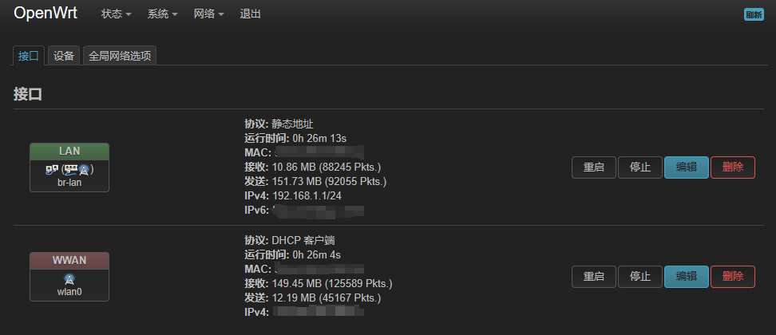
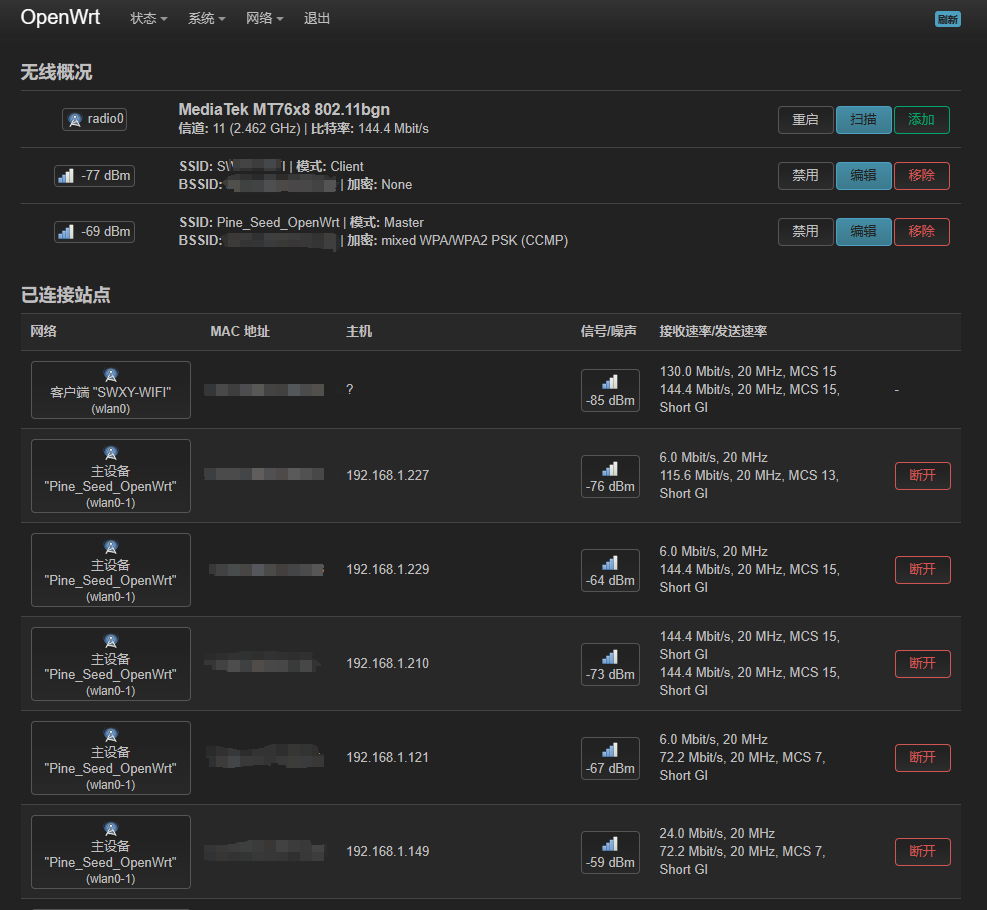

# WL-Network-Automation

基于嵌入式系统(OpenWrt)扩展的校园网多终端自动登录脚本

本项目脚本遵循MIT开源协议，仅供学习技术交流，请在没有违反当地法律法规的情况下进行使用与二次开发等

------

本项目所实现的脚本可用于大部分嵌入式系统设备或者软路由，不局限于OpenWrt

- 开机自动登陆校园网，断网自动重登重连
- 遇到奇怪情况会自己重启设备
- 它可以使多台设备接入这个网络不受校园网多设备限制影响
- 它也会操作你的路由器或其它设备的灯光炫酷闪烁！

对于有多个账号的同学来讲你可以配置OpenWrt或其他系统设备进行账号多拨，使你的网速翻倍！

本项目是通过某理学院的校园网进行开发，已经在脚本中注明更改哪个位置的代码可将其使用在自己的学校的校园网中，请自行获取自己学校登录post/get请求url，大部分校园网络可以通过修改此处完成，不能保证全部，如有不一样的地方可自行修改代码

### 如何使用？（以OpenWrt来设置）

在你安装好OpenWrt后，会有以下两种情况

#### 有线连接

在路由器等设备安装好OpenWrt后将网线接入WAN口即可使用校园网

#### 无线连接

有些宿舍等地方未带有网线接口，我们将用OpenWrt的客户端转发方式来与校园网通信

进入OpenWrt后台，在网络接口新建一个WAN口与LAN口设备，使此LAN口的网络可以连接到这个WAN口（可能需要网线连接路由器等设备才能操作）

然后在网络无线中使用扫描选择校园网WIFI，接口配置模式选择客户端，ESSID填写校园网WIFI名称即可，然后选择指派到此无线接口的网络为刚创建的WAN口

随后再添加一个无线网络用于供我们使用的无线WIFI，模式选择接入点AP，选择指派到此无线接口的网络为刚创建的LAN口

#### 自动登陆校园网

在根据自身需求做完上述设置以后，在OpenWrt页面进入将`self_start.sh`文件内容放入启动项中，将`task.sh`放入计划任务中，重启路由器等设备后检测效果即部署完成

其他嵌入式系统设备或软路由等请自测，基本都支持